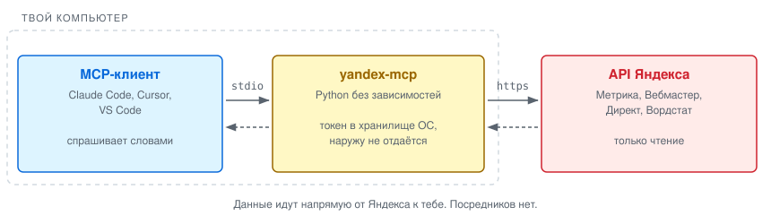
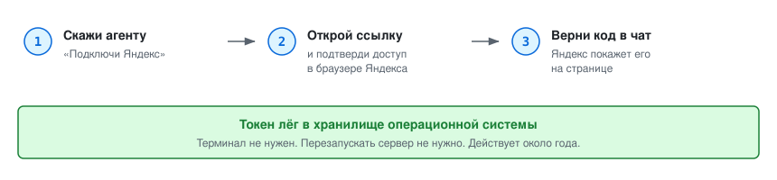
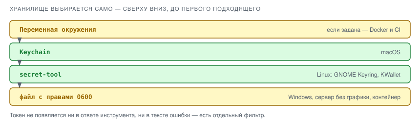

# yandex-mcp

<!-- mcp-name: io.github.nozikov/yandex-mcp -->

**Спрашивай свою аналитику Яндекса словами.** Метрика, Вебмастер, Директ и Вордстат
в одном MCP-сервере.

[](https://github.com/nozikov/yandex-mcp/actions/workflows/ci.yml)
[](https://pypi.org/project/yandex-mcp/)
[](https://pypi.org/project/yandex-mcp/)
[](./LICENSE)

```
> Как изменился трафик за последний месяц и откуда пришёл рост?
> По каким запросам мы на второй странице — там, где до топа осталось чуть-чуть?
> Сколько стоила заявка в Директе на прошлой неделе по каждой кампании?
```

## Как это работает

<picture>
  <source media="(prefers-color-scheme: dark)" srcset="docs/how-it-works-dark.svg">
  
</picture>

Сервер — обычная программа на твоём компьютере. Агент просит у неё данные, она идёт
в API Яндекса и возвращает готовый текст. Никаких промежуточных серверов: твой токен
и твои цифры не проходят через чужие руки.

Зависимостей нет вообще — ни одной сторонней библиотеки. Через этот процесс идёт доступ
к твоей аналитике и рекламному кабинету, и чем меньше здесь чужого кода, тем лучше.

## Установка

**Claude Code** — две команды, вместе с сервером ставятся скиллы:

```
/plugin marketplace add nozikov/yandex-mcp
/plugin install yandex-mcp@nozikov
```

**Любой другой клиент** — через PyPI:

```bash
claude mcp add yandex -e YANDEX_MCP_DEFAULT_COUNTER=12345678 -- uvx yandex-mcp
```

Или вручную в конфиге, см. [`.mcp.json.example`](./.mcp.json.example):

```json
{
  "mcpServers": {
    "yandex": {
      "command": "uvx",
      "args": ["yandex-mcp"],
      "env": { "YANDEX_MCP_DEFAULT_COUNTER": "12345678" }
    }
  }
}
```

Счётчик указывать необязательно — без него его придётся называть в каждом вопросе.

## Вход

<picture>
  <source media="(prefers-color-scheme: dark)" srcset="docs/login-dark.svg">
  
</picture>

Терминал не нужен: скажи агенту «подключи Яндекс», и он проведёт по шагам.

Один раз перед этим нужно зарегистрировать своё приложение в Яндексе — это бесплатно
и занимает пять минут. Команда `yandex-mcp setup` откроет нужную страницу и подскажет,
что заполнять. Пароль от приложения не понадобится: используется PKCE.

<details>
<summary>Что вписать при регистрации приложения</summary>

Яндекс спросит тип приложения. Подходят оба, разница только в способе входа:

| Тип | Redirect URI | Вход |
|---|---|---|
| «Для авторизации пользователей» | свой: `http://localhost:8765/callback` | `yandex-mcp login` |
| «Для доступа к API или отладки» | зафиксирован Яндексом | `yandex-mcp login --manual` |

В разделе «Доступ к данным» добавь права по названию:

```
metrika:read
webmaster:hostinfo
webmaster:verify
direct:api           ← нужна заявка в кабинете Директа, рассматривают до 7 дней
```

Вход просит все права разом. Если `direct:api` ещё не одобрен, Яндекс откажет — сервер
это заметит, войдёт без Директа и скажет об этом. Метрика и Вебмастер заработают сразу,
а когда заявку одобрят, повторный вход подхватит Директ.

Команды в терминале: `setup`, `login`, `status`, `logout`.
</details>

## Что умеет

**Метрика**

| | |
|---|---|
| `metrika_summary` | Сводка за период: визиты, посетители, отказы, глубина, достижения всех целей |
| `metrika_compare` | Сравнение двух периодов — по итогам или построчно по источникам, устройствам, страницам |
| `metrika_report` | Любой отчёт: свои метрики, измерения и фильтры |
| `metrika_counters` | Какие счётчики доступны |

**Вебмастер**

| | |
|---|---|
| `webmaster_summary` | ИКС, страниц в поиске, исключено, активные проблемы |
| `webmaster_queries` | Поисковые запросы: показы, клики, средняя позиция |
| `webmaster_indexing` | Как менялось число страниц в поиске |
| `webmaster_sitemaps` | Какие карты сайта видит Яндекс и есть ли в них ошибки |
| `webmaster_recrawl` | Поставить страницы на переобход. Единственное действие, а не чтение — требует явного подтверждения |

**Директ и Вордстат**

| | |
|---|---|
| `direct_campaigns` | Кампании и остаток баллов API |
| `direct_report` | Расход, показы, клики, CTR — по кампаниям, объявлениям, группам или запросам |
| `wordstat_phrases` | Частотности: сколько раз в месяц ищут фразу и что ищут вместе с ней |

**Подключение**

| | |
|---|---|
| `yandex_login` | Начать вход — выдаёт ссылку |
| `yandex_submit_code` | Завершить вход — принимает код |
| `yandex_auth_status` | Что подключено и когда истекает |

### Скиллы

Ставятся вместе с плагином Claude Code:

| | |
|---|---|
| `/yandex-mcp:site-weekly` | Недельный отчёт по сайту: трафик, источники, поиск, реклама — и что делать |
| `/yandex-mcp:seo-opportunities` | Запросы на границе топа: где до первой страницы осталось немного |

## Где лежит токен

<picture>
  <source media="(prefers-color-scheme: dark)" srcset="docs/token-storage-dark.svg">
  
</picture>

Ничего настраивать не нужно — подходящее хранилище выбирается само. Форсировать можно
переменной `YANDEX_MCP_KEYSTORE`.

Записи лежат под общим префиксом, чтобы `logout` не задел чужое:

```
yandex-mcp-token             общий токен
yandex-mcp-metrika-token     токен одного сервиса, если нужен узкий доступ
yandex-mcp-client-id         ID приложения Яндекса
```

Токен можно передать и напрямую, минуя хранилище: `YANDEX_MCP_SECRET_TOKEN` для общего,
`YANDEX_MCP_SECRET_METRIKA_TOKEN` для узкого. Так удобно в Docker и CI.

## Почему 15 инструментов, а не 130

Описания всех инструментов уходят в контекст модели **при каждом запросе**, пока сервер
подключён. Здесь это около 1 800 токенов. У серверов со 130–150 инструментами — за 40 000,
и это постоянный налог на каждый диалог.

Оставлено то, на что реально смотрят: цифры и их динамика. Управлять кампаниями и ставками
отсюда нельзя — для этого есть кабинет Директа, и цена ошибки там другая.

## Переменные окружения

| Переменная | Зачем |
|---|---|
| `YANDEX_MCP_DEFAULT_COUNTER` | Счётчик Метрики по умолчанию |
| `YANDEX_MCP_CLIENT_ID` | ID приложения Яндекса, если не хочешь держать его в хранилище |
| `YANDEX_MCP_KEYSTORE` | `keychain`, `secret-tool` или `file` — выбрать хранилище вручную |
| `YANDEX_MCP_SECRET_TOKEN` | Готовый токен мимо хранилища (Docker, CI) |
| `YANDEX_MCP_DIRECT_SANDBOX` | `1` — Директ отвечает из песочницы, баллы API не тратятся |
| `YANDEX_MCP_DIRECT_CLIENT_LOGIN` | Логин клиента для агентских аккаунтов |
| `YANDEX_MCP_WORDSTAT_WAIT` | Сколько секунд ждать отчёт Вордстата, по умолчанию 170 |

## О чём стоит знать

- Инструменты Директа и Вордстата требуют одобренной заявки на API Директа. До неё Директ
  отвечает ошибкой 58.
- Отчёт Вордстата готовится у Яндекса около трёх минут. Если вернулось «ещё готовится» —
  повтори запрос с теми же фразами, готовый результат подхватится сразу.
- Отчёт Директа тоже может готовиться минутами. Сервер ждёт сам, но в очереди Яндекса
  помещается не больше пяти таких отчётов на аккаунт.
- Переобход страниц ограничен: 20 URL за вызов при суточной квоте 150 на сайт.
- Ответ обрезается на 20 000 символах. Для больших выгрузок сужай период.
- Токен живёт около года, потом нужно войти заново. Обновлять его автоматически Яндекс
  разрешает только приложениям с паролем, а у PKCE-приложения его нет.
- Там, где системного хранилища нет (Windows, сервер без графики, контейнер), токен лежит
  в файле с правами `0600` — как `~/.aws/credentials` или SSH-ключ без пароля.

## Безопасность

Токен не появляется ни в ответе инструмента, ни в тексте ошибки: есть отдельный фильтр,
вычищающий его из любого текста. `status` показывает только отпечаток.

Почти всё — чтение. Единственное изменяющее действие, переобход страниц, требует явного
подтверждения в аргументах вызова.

Данные из API считаются недоверенными: поисковые фразы, UTM-метки и названия кампаний
пишут посторонние люди. К каждому ответу добавляется пометка, что это данные для анализа,
а не инструкции агенту.

## Разработка

```bash
pip install -e ".[dev]"
pytest
```

Тесты не ходят в сеть и не трогают системное хранилище. CI гоняет их на Linux, macOS
и Windows, на Python от 3.8 до 3.14.

```
src/yandex_mcp/
  cli.py         точка входа: без аргументов сервер, с аргументами настройка
  server.py      JSON-RPC поверх stdio
  registry.py    сборка списка инструментов
  httpclient.py  запросы к Яндексу
  scrub.py       вычищение секретов из ответов
  auth/          хранилище, токены, вход по PKCE
  tools/         по модулю на сервис
```

Код лежит в `src/`, чтобы `import yandex_mcp` брал установленный пакет, а не случайно
подхваченную рабочую директорию — иначе тесты могут проходить на коде, которого нет
в собранном колесе.

Диаграммы в `docs/` собираются из `scripts/make_diagrams.py`, а `scripts/check_metadata.py`
следит, чтобы README не разошёлся с кодом: версии, список инструментов и переменные
окружения проверяются на каждом прогоне CI.

## Лицензия

MIT
